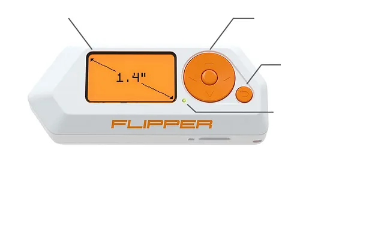
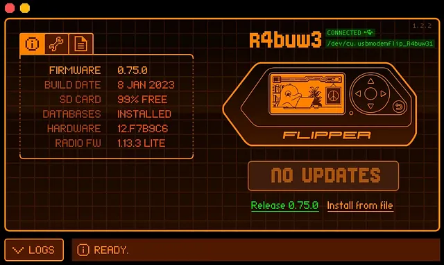

***Cet article est le premier d'une série dont le sujet, vous l'aurez deviné, est le <a href="https://shop.flipperzero.one/">Flipper Zéro</a>.*** 

> *Les articles concernant mes recherches sur le Flipper Zéro seront rédigés en français et en anglais.*

 

# **Sommaire**

1. **Introduction**
2. **Présentation du *Flipper Zéro***
3. **Fonctionnalités du *Flipper Zéro***
    - 🗝️ WiFi Dev Board
    - 🗝️ Prototyping Board
    - 🗝️ Fonctionnalités de base
    - 🗝️ U2F (Universal 2nd Factor)
    - 🗝️ Fréquence et analyseur de signaux
    - 🗝️ Émulation de cartes RFID/NFC
        - 🔎 RFID
        - 🔎 NFC
    - 🗝️ Contrôle d'appareils infrarouges
    - 🗝️ BadUSB
4. **Avantages | Inconvénients**
    - 💪 Avantages
    - 👎 Inconvénients
5. **Cas d'utilisation**
6. **🤝Conclusion🤝**

 

# **Introduction**

Dans cet article, nous allons explorer les fonctionnalités du *Flipper Zéro*, un outil polyvalent qui trouve sa place dans le domaine de la cybersécurité et du prototypage IoT. Nous allons examiner les différentes caractéristiques de cet outil et les avantages qu'il offre.

Que vous soyez un professionnel de la sécurité cherchant à tester les réseaux sans fil ou un passionné d'IoT à la recherche d'une solution de prototypage rapide, le *Flipper Zéro* pourrait bien être l'outil dont vous avez besoin.

 

# **Présentation du *Flipper Zéro***

Le *Flipper Zéro* est un outil innovant qui combine plusieurs fonctionnalités essentielles pour la sécurité et le prototypage IoT. Il se présente sous la forme d'un petit appareil portable avec un écran LCD, des boutons et une connectivités sans fil. L'outil est conçu pour être facilement programmable et personnalisable, ce qui en fait un bon choix.

    
    
    

 

# **Fonctionnalités du *Flipper Zéro***

## 🗝️ WiFi Dev Board

L'une des fonctionnalités clés de cet outil, est sa capacité à fonctionner comme une carte de développement WiFi. Cela signifie qu'il peut se connecter à des réseaux sans fil, analyser les points d'accès et effectuer des tests de sécurité sur les réseaux WiFi.

Cette fonctionnalité peut être utilisée par exemple, vous pouvez l'utiliser pour détecter et analyser des points d'accès WiFi disponibles dans les environs. L'outil vous permettra d'obtenir des informations détaillées sur chaaque point d'accès, telles que le *SSID*, la *force du signal*, le *type de chiffrement*, etc.

 

## 🗝️ Prototyping Board

En plus de ses fonctionnalités WiFi, il peut également être utilisé comme une carte de prototypage pour le développement d'application IoT. Il est doté de broches d'entrée/sortie (GPIO) qui permet de connecter des capteurs, actionneurs, et d'autres composants électroniques. Cela facilite le prototypage rapide de solution IoT.

En utilisant cet fonctionnalité de prototypage, vous pouvez développer des fonctionnalités spécifiques pour votre système de détection d'intrusion. Par exemple, vous pouvez le programmer pour surveiller les communications sans fil, analyser les paquets de données IoT et identifier les schémas d'attaque courants.

 

## 🗝️ Fonctionnalité de base

En plus de ses fonctionnalités avancées, le *Flipper Zéro* propose également des fonctionnalités de base qui le rendent polyvalent et pratique à utiliser au quotidien.

Il dispose d'un écran réactif et d'une interface utilisateur intuitive, ce qui facilite la navigation et l'interaction avec l'outil. La batterie est aussi un point fort.

 

## 🗝️ U2F (Universal 2nd Factor)

Ma fonctionnalité favorite et que j'utilise quotidiennement, la U2F. Le *Flipper Zéro* prend en charge la norme U2F, ce qui en fait un outil pratique pour renforcer la sécurité de vos comptes. En l'utilisant comme dispositif d'authentification U2F, vous ajouterez une couche supplémentaire de protection, réduisant ainsi les risques d'accès non autorisé à vos comptes.

 

## 🗝️ Fréquence et analyseur de signaux

Cet outil offre la possibilité d'analyser et de travailler avec différentes fréquences radio. Cela permet d'explorer et de comprendre les signaux émis par des appareils sans fil tels que les télécommandes, les capteurs, les systèmes de communication, etc. Grâce à son analyseur de signaux intégré, vous pouvez visualiser et interagir avec les différentes fréquences, ouvrant ainsi la voie à des applications avancées.

Avec cette fonctionnalité, vous pourrez, par exemple, scanner et analyser les différentes fréquences radio dans un environnement donné. Il vous permettra de détecter les fréquences utilisées par les appareils sans fil, tels que les télécommandes, les capteurs, les dispositif de communication, comme dis dans le paragraphe précédent.

## 🗝️ Émulation de cartes RFID/NFC

Il dispose d'une fonctionnalité d'émulation de cartes RFID/NFC, vous permettant d'interagir avec des systèmes de contrôle d'accès et d'explorer des possibilités offertes par cette technologie.

### 🔎 RFID

Utiliser cette fonctionnalité, par exemple, pour émuler une carte *RFID* spécifique et testez la sécurité des systèmes de contrôle d'accès. En émulant une carte d'accès autorisé, vous pouvez vérifier si le système de contrôle d'accès est correctement configuré et si des vulnérabilités existent, telles que l'utilisation de cartes non sécurisée, des erreurs de configuration ou des protocoles de communication faibles.

### 🔎 NFC

La technologie *NFC* peut être utilisé, par exemple, pour émuler une carte de paiement sans contact spécifique. Cela vous permet de simuler des tansactions de paiement sans contact et d'analyser les protocoles de communication utilisés entre le terminal de paiement sans contact et la carte émulée. On peut ensuite vérifier si les protocles sont correctement sécurisée et si des données sensibles sont transmises.

 

## 🗝️ Contrôle d'appareils infrarouge

Avec sa fonction de contrôle d'appareils infrarouges, le *Flipper Zéro* vous permet de prendre le contrôle de nombreux appareils électroniques couramment utilisés, tels que les téléviseurs, les climatiseurs, etc. Vous pouvez créer des commandes personnalisées et effectuer des actions à distance.

Vous pourrez utiliser cette fonctionnalité, par exemple, pour programmé et émuler différentes télécommandes infrarouges. Cela permet de simuler des commandes et des actions spécifiques sur des appareils contrôlés par infrarouge. Cette émulation vous permet de tester la sécurité des systèmes contrpolés par infrarouge.

 

## 🗝️ BadUSB

L'une des fonctionnalités puissantes du *Flipper Zéro* est sa capacité à agir en tant que dispositif BadUSB. Le BadUSB est une technique où un appareil USB malveillant se fait passer pour un périphérique de confiance afin de compromettre un système. *Flipper Zéro* peut être programmé pour agir en tant que BadUSB.

Dans le cas d'un test d'intrusion, cette fonctionnalité serait surtout utilisée pour l'exploitation d'un système via l'injection et l'exécution de code malveillant. Mais elle peut aussi être utilisé pour le développement de *contre-mesures*.

> *<u>Contre-Mesure :</u> Mesure de sécurité informatique défensive prenant la forme d'une technique, d'un dispositif, d'une procédure et dont le but est de s'opposer à un effet, de contrer une attaque précise susceptible de porter atteinte aux biens informatiques.*

En l'utilisant pour simuler des attaques BadUSB, vous pouvez également travailler sur le développement de *contre-mesures* pour renforcer la sécurité des systèmes. L'objectif est d'identifier les failles de sécurité exploitée par les attaques BadUSB et mettre ne place des mesures de prévention et de détection.

En combinant ces fonctionnalités de base avec les fonctionnalités avancées mentionnées précédemment, le *Flipper Zéro* devient un outil complet et puissant pour les amateurs d'IoT mais aussi les professionnels de la cybersécurité. Il offre un large éventail de possibilités et vous permet d'explorer de nouveaux domaines.

 

# **Avantages | Inconvénients**

## 💪 Avantanges

- *Polyvalence*
- *Portabilité*
- *Facilité*
- *Personnalisable*
- *Fonctionnalités avancées*

## 👎 Inconvénients

- *Limitations du matérielles*
- *Coût*

# **Cas d'utilisation**

*Flipper Zéro* offre une multitude de possibilités d'utilisation dans le domaine de la cybersécurité et du prototypage IoT. En tant qu'outil de sécurité, il peut être utilisé pour réaliser des tests de sécurité des réseaux sans fil, auditer les systèmes de sécurité et détecter les vulnérabilités. Pour les passionnés d'IoT, il offre une plateforme de prototypage rapide pour développer des applications et expérimenter de nouvelles idées dans le domaine de l'*Internet des Objets*.

 

# **Conclusion**

Pour conclure, le *Flipper Zéro* est un outil polyvalent qui offre des fonctionnalités intéressantes pour les professionnels de la cybersécurité et les passionnés de l'IoT. Que ce soit pour effectuer des tests de sécurité WiFi, développer rapidement des prototypes IoT ou explorer de nouvelles possibilités, le *Flipper Zéro* se révèle être un outil précieux. Avec ses caractéristiques personnalisables et sa Portabilité, il ouvre de nombreuses perspectives dans le domaine de la sécurité et du prototypage. Alors, n'hésitez pas à explorer d'avantage les fonctionnalités du *Flipper Zéro* et à repousser les limites de vos projets avec cet outil.

Dans cet article, nous nous sommes concentrée sur l'aspect et les fonctionnalités globales de l'outil, dans les articles suivants, nous parlerons plus précisément des fonctionnalités mais aussi de leurs attaques accompagnée d'exemples de cas, nous parlerons également des différents firmware disponible en les comparants.
